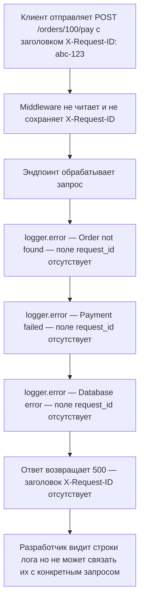
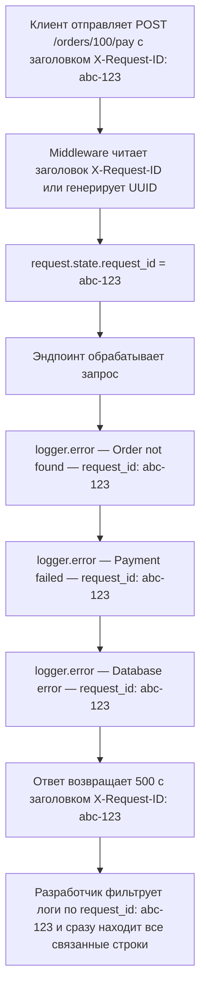

<p align="right">
  <a href="README.md">English</a> |
  <a href="README.ru.md">Русский</a>
</p>

# Без request ID отладка становится почти невозможной

## Краткое описание

Эндпоинт пишет ошибки в логи, но эти логи нельзя связать с конкретным HTTP-запросом.

Логи вроде бы есть, но нет связи между событиями. В production это превращает отладку в угадывание.

## Metadata

- ID: `BFL-0005`
- Category: `observability-debugging`
- Secondary categories: `api-http`, `reliability-failure-recovery`
- Level: `beginner`
- Technologies: `python`, `fastapi`, `pytest`
- Failure modes: `missing-observability`
- Patterns: `request-id`, `structured-logging`
- Status: `released`

## Проблема

Пользователь отправляет запрос, и внутри backend что-то ломается.

В логах есть сообщения:

```text
Order not found
Payment failed
Database error
```

Таких сообщений недостаточно, когда одновременно выполняется много запросов. В них нет стабильного значения, которое связывает HTTP-запрос, внутреннюю операцию и ошибки.

## Почему это происходит в production

Junior-разработчики часто думают, что `print()` или `logger.error()` уже достаточно.

В production важен не только вопрос что сломалось. Обычно нужно понять, какой запрос сломался, какой пользователь его вызвал и какие логи относятся к той же цепочке выполнения.

Без request ID логи разных запросов перемешиваются.

## Сценарий бага

1. Клиент отправляет `POST /orders/100/pay`.
2. Эндпоинт пишет несколько ошибок в лог.
3. Ответ не содержит `X-Request-ID`.
4. Логи не содержат `request_id`.
5. Разработчик не может связать ответ со строками лога.

## Сломанная реализация

Сломанная реализация пишет обычные строки лога:

```python
logger.error("Order not found")
logger.error("Payment failed")
logger.error("Database error")
```

Эти сообщения описывают события, но не содержат контекст запроса.

## Где именно происходит ошибка

Ошибка происходит на границе HTTP-запроса.

В `broken/app.py` эндпоинт получает `X-Request-ID`, но приложение не приводит его к единому правилу, не возвращает в ответе и не добавляет в логи.

Backend должен иметь один ID запроса, который проходит через весь запрос и появляется во всех важных строках лога.

## Как отлавливать такую ошибку

Недостаточно проверить, что ошибка была залогирована.

Полезный тест на наблюдаемость должен проверять, что:

1. ответ содержит `X-Request-ID`;
2. каждая важная строка лога содержит тот же request ID;
3. есть структурированные поля вроде `event`, `user_id`, `order_id`.

Так логи можно искать и связывать во время разбора инцидента.

## Падающий тест

Падающий тест отправляет запрос с заголовком:

```http
X-Request-ID: abc-123
```

Безопасное поведение:

- заголовок ответа `X-Request-ID` равен `abc-123`;
- логи ошибок содержат тот же request ID.

Сломанная реализация пишет обычные сообщения и не возвращает request ID, поэтому тест падает.

## Диагностика

Система ломается, потому что логи не связаны между собой.

Строка лога без контекста запроса может быть технически правдивой, но почти бесполезной при отладке. Она говорит, что что-то произошло, но не говорит, какой запрос это вызвал.

## Исправленная реализация

Исправленная реализация добавляет обработку request ID на уровне middleware:

```python
request_id = request.headers.get("X-Request-ID") or str(uuid4())
request.state.request_id = request_id
response.headers["X-Request-ID"] = request_id
```

Middleware хорошо подходит для этого, потому что все эндпоинты получают одинаковое поведение. После этого эндпоинт может писать структурированные логи с тем же `request_id` и полезными полями вроде `event`, `user_id`, `order_id`.

В этом case структурированные логи сделаны через JSON-строки, чтобы реализация оставалась маленькой. В реальном сервисе можно использовать форматтер логов, контекстные переменные или библиотеку для структурированного логирования, но главное правило то же: каждый лог одного запроса должен нести один и тот же request ID.

## Как запустить

Из корня репозитория:

### Сломанная версия

```bash
make broken CASE=BFL-0005
```

Ожидаемо: тест должен упасть, потому что сломанная реализация не связывает ответ и логи.

### Исправленная версия

```bash
make fixed CASE=BFL-0005
```

Ожидаемо: тесты должны пройти, потому что исправленная реализация возвращает и логирует один и тот же request ID.

## Файлы

- `broken/` - реализация с обычными логами и без передачи request ID
- `fixed/` - реализация с middleware для request ID и структурированными логами
- `tests/` - тесты, которые проверяют связь ответа и логов

## Диаграммы

Сломанный поток:



Исправленный поток:



Те же диаграммы хранятся в:

- [`assets/broken-flow.mmd`](assets/broken-flow.mmd)
- [`assets/fixed-flow.mmd`](assets/fixed-flow.mmd)

## Заметки для production

Request IDs полезнее всего, когда они проходят через границы: HTTP-запрос, логи базы данных, фоновые задачи, внешние API-вызовы и сбор ошибок.

Если upstream gateway уже присылает `X-Request-ID`, backend обычно должен сохранить его. Если ID нет, backend должен сгенерировать его и вернуть клиенту.

Не логируй чувствительные данные только ради удобства отладки. Лучше логировать стабильные ID и названия событий.

## Компромиссы

Request ID простой и дешёвый, но он работает только если каждая важная строка лога его содержит.

Middleware даёт единое поведение для HTTP-запросов, но фоновые задачи требуют отдельной стратегии передачи request ID.

Структурированные логи проще искать и агрегировать, но нужно договориться об одинаковых названиях полей.
